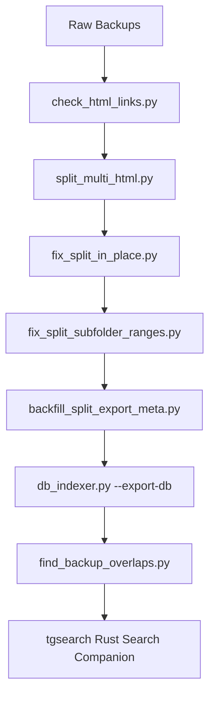

# tgbackman — Telegram Backup Workflows & SQLite Search Indexer

A premium, high-performance command-line toolbox designed to manage, repair, split, rename, analyze, and index massive multi-format Telegram backup archives into a consolidated master SQLite database for optimized full-text searching.

---

## 📂 Project Structure & Directory Tree

```text
tgbackman/
├── .gitignore                         # Git exclusion rules
├── README.md                          # Comprehensive project documentation (this file)
├── requirements.txt                   # Python package dependencies
├── backup_inspect.py                  # Main recursive backup scanner and summarizer
├── split_multi_html.py                # Multi-chat HTML export splitter
├── repair_html_links.py               # In-place HTML link repair script
├── db_indexer.py                      # Highly optimized SQLite database ingester & parser (HTML/JSON/SQLite)
├── find_backup_overlaps.py            # Overlap, containment, and gap analyzer for sibling backups
├── check_html_links.py                # Scanner to verify that all local asset links (href/src) resolve
├── fix_split_in_place.py              # Media relocalizer for split exports (avoids asset duplication)
├── fix_split_subfolder_ranges.py      # Safety-focused UTC chronological range standardizer (HTML/JSON/SQLite)
├── backfill_split_export_meta.py      # Meta-file backfiller to register split folders in backup_inspect
├── tgbackman/                         # Rust GUI overlap and coverage visualizer
│   ├── Cargo.toml                     # Rust GUI project manifest
│   └── src/                           # Rust GUI source code
└── tgsearch/                          # High-performance compiled Rust search companion
    ├── Cargo.toml                     # Rust search manifest
    ├── README.md                      # Rust search companion documentation
    ├── src/                           # Rust search companion source code
    └── rules/                         # Directory for anonymization & sanitization rules
```

---

## 🛠️ Detailed Scripts & Tooling Reference

This section outlines what each script does, its inputs, and its outputs.

### 1. [backup_inspect.py](backup_inspect.py)
* **Purpose**: Primary CLI analyzer. Discovers and inspects Telegram backups recursively, displaying detailed counts, date ranges, and size footprint on disk using `dust` or `du` tool calls.
* **Inputs**:
  - `path`: A directory path containing Telegram backup exports.
* **Outputs**:
  - Prints a structured tree report with backup formats, message counts, ranges, and sizes.
* **CLI Invocation Example**:
  ```bash
  python3 backup_inspect.py "/media/user/1b/Telegram Backup"
  ```

### 2. [split_multi_html.py](split_multi_html.py)
* **Purpose**: Converts a multi-chat official HTML export folder into discrete, self-contained single-chat exports.
* **Inputs**:
  - `path`: Official multi-chat HTML export directory.
  - `--out`: Output directory (default: `<parent>/<basename>_single_chats`).
* **Outputs**:
  - Reorganized per-chat export directories containing localized assets.
* **CLI Invocation Example**:
  ```bash
  python3 split_multi_html.py "/media/user/1b/Telegram Backup/RawMultiExport"
  ```

### 3. [repair_html_links.py](repair_html_links.py)
* **Purpose**: Rewrites broken local HTML href/src/srcset links that contain unescaped hashes (`#`) in their filenames to URL-encoded paths (`%23`) in-place.
* **Inputs**:
  - `path`: Directory containing Telegram HTML backups.
* **CLI Invocation Example**:
  ```bash
  python3 repair_html_links.py "/media/user/1b/Telegram Backup/ChatName"
  ```

### 4. [db_indexer.py](db_indexer.py)
* **Purpose**: Highly optimized database indexing engine. It ingests JSON, HTML, and unofficial SQLite backups, indexing messages at speeds exceeding **200,000 messages per second**.
* **Inputs**:
  - `path`: Directory containing backup folders to scan recursively.
  - `--export-db`: Path to the output SQLite database.
* **Outputs**:
  - A consolidated, search-optimized SQLite master database with FTS5 virtual tables and sync triggers.
* **CLI Invocation Example**:
  ```bash
  python3 db_indexer.py "/media/user/1b/Telegram Backup/SplitChats" --export-db "/media/user/1b/sqlitedb/telegram_backup.db"
  ```

### 5. [find_backup_overlaps.py](find_backup_overlaps.py)
* **Purpose**: Analyzes sibling backups representing the same physical chats, calculates chronological overlap containment percentages, and runs indexed range scans to identify gaps or missing messages.
* **Inputs**:
  - Absolute path to the consolidated master SQLite database (`telegram_backup.db`).
* **Outputs**:
  - Detailed console reports detailing sibling overlap alignments, coverage percentages, and gap warnings.
* **CLI Invocation Example**:
  ```bash
  python3 find_backup_overlaps.py "/media/user/1b/sqlitedb/telegram_backup.db"
  ```

### 6. [check_html_links.py](check_html_links.py)
* **Purpose**: Scans all `.html` files in a backup folder and verifies that local on-disk assets (such as images, avatars, or media) referred to by `href`, `src`, `poster`, CSS `url()`, or `srcset` paths actually exist.
* **Inputs**:
  - A directory containing Telegram HTML backups.
* **CLI Invocation Example**:
  ```bash
  python3 check_html_links.py "/media/user/1b/Telegram Backup/ChatName"
  ```

### 7. [fix_split_in_place.py](fix_split_in_place.py)
* **Purpose**: Fixes split multi-chat HTML exports in-place by relocalizing leftover `../../chats/chat_XXX/...` media references to keep single chat folders standalone without duplicating massive media folders.
* **Inputs**:
  - `single_root`: Split output directory.
  - `--multi-root`: Original multi-chat HTML export root.
* **CLI Invocation Example**:
  ```bash
  python3 fix_split_in_place.py "/media/user/1b/Telegram Backup/SplitChats" --multi-root "/media/user/1b/Telegram Backup/RawMultiExport"
  ```

### 8. [fix_split_subfolder_ranges.py](fix_split_subfolder_ranges.py)
* **Purpose**: Renames nested per-chat range directories (and any generic backup folders placed under a parent chat directory) to standard UTC date-span format (`YYYY-MM-DDTHH-MM-SSZ__YYYY-MM-DDTHH-MM-SSZ`). Supports HTML, JSON, and SQLite backups.
* **Inputs**:
  - Parent root directory containing chat subfolders.
* **CLI Invocation Example**:
  ```bash
  python3 fix_split_subfolder_ranges.py "/media/user/1b/Telegram Backup/SplitChats" --apply
  ```

### 9. [backfill_split_export_meta.py](backfill_split_export_meta.py)
* **Purpose**: Backfills `.backman_export_meta.json` files into split output folders to register them within `backup_inspect.py` as `html_single_chat_export_converted`.
* **Inputs**:
  - Root split directory.
* **CLI Invocation Example**:
  ```bash
  python3 backfill_split_export_meta.py "/media/user/1b/Telegram Backup/SplitChats" --apply
  ```

---

## 🔄 End-to-End Master Pipeline Workflow

To ingest your raw Telegram backups, analyze overlaps, and search them cleanly, execute this pipeline in the following sequence:



### 1️⃣ Step 1: Health Check (Optional but Recommended)
Scan your raw HTML files to check if there are missing attachments or assets:
```bash
python3 check_html_links.py "/media/user/1b/Telegram Backup/RawExport"
```

### 2️⃣ Step 2: Split Official Multi-Chat HTML Exports
If you have an official multi-chat HTML export containing multiple chats, split it into discrete folders:
```bash
python3 split_multi_html.py "/media/user/1b/Telegram Backup/RawMultiExport"
```

### 3️⃣ Step 3: Relocalize Split Assets in Place
Relocalize media file paths in split chats to avoid massive asset duplication while maintaining fully-functioning local files:
```bash
python3 fix_split_in_place.py "/media/user/1b/Telegram Backup/SplitChats" --multi-root "/media/user/1b/Telegram Backup/RawMultiExport"
```

### 4️⃣ Step 4: Chronological Subfolder Naming and Metadata Backfill
Standardize subfolder names based on actual minimum/maximum UTC timestamps (supports HTML, JSON, and SQLite formats), then backfill `.backman_export_meta.json` so they are fully discovered by the main scanner:
```bash
# Check planned folder renames (dry-run)
python3 fix_split_subfolder_ranges.py "/media/user/1b/Telegram Backup/SplitChats"

# Apply renames and backfill metadata
python3 fix_split_subfolder_ranges.py "/media/user/1b/Telegram Backup/SplitChats" --apply
python3 backfill_split_export_meta.py "/media/user/1b/Telegram Backup/SplitChats" --apply
```

### 5️⃣ Step 5: Master Database Ingestion
Index all standardized backups recursively into a single, high-performance search-optimized master SQLite database file:
```bash
python3 db_indexer.py "/media/user/1b/Telegram Backup/SplitChats" --export-db "/media/user/1b/sqlitedb/telegram_backup.db"
```

### 6️⃣ Step 6: Overlap and Gap Analysis
Analyze the integrity of your backup database, verifying alignment coverages and identifying any missing messages:
```bash
python3 find_backup_overlaps.py "/media/user/1b/sqlitedb/telegram_backup.db"
```

### 7️⃣ Step 7: GUI Overlap Visualization
Run the Rust-based visualizer `tgbackman` to see coverage ranges, duplicates, and stats interactively:
```bash
cd tgbackman
cargo run -- "/media/user/1b/sqlitedb/telegram_backup.db"
```

### 8️⃣ Step 8: Search Companion Ingestion
Navigate to the `tgsearch/` subdirectory and invoke the ultra-fast Rust search companion `tgsearch` to perform query searches, deduplication, and case-insensitive username sanitization:
```bash
# Navigate and build (if not already built)
cd tgsearch
cargo build --release

# Execute query searches
./target/release/tgsearch "/media/user/1b/sqlitedb/telegram_backup.db" "makeup OR alcohol" --no-time -l 80 --dedupe --no-header --sanitise "rules/bad_language_rules.txt"
```

---

## 🔒 Security, Privacy & Performance Designs

> [!IMPORTANT]
> **Performance Optimization**: `db_indexer.py` leverages bulk transaction batches (50,000+ operations per transaction) coupled with SQLite write-ahead-logging (`PRAGMA journal_mode=WAL`), asynchronous synchronization (`PRAGMA synchronous=NORMAL`), and large cache allocations to achieve lightning-fast throughput exceeding **200,000 messages/sec**.

> [!NOTE]
> **Leak-Proof Sanitization**: When querying the master database through `tgsearch` with `--sanitise`, the engine employs automatic name-aliasing. A user's target variations (e.g. system username and its reverse spelling) are linked together dynamically so that substituting one automatically substitutes both in a case-insensitive fashion. This preserves total sender privacy.

> [!WARNING]
> **Database Locks**: While ingestion utilizes WAL mode, always ensure that other handles to the SQLite database (like active search queries) are read-only or closed during heavy write pipelines to prevent database busy lock scenarios (`SQLITE_BUSY`).
