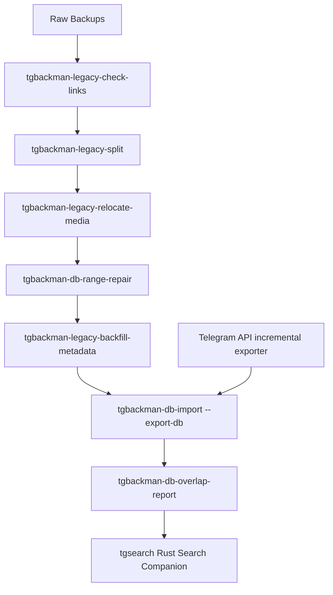

# tgbackman — Telegram Backup Workflows & SQLite Search Indexer

A premium, high-performance command-line toolbox designed to manage, repair, split, rename, analyze, and index massive multi-format Telegram backup archives into a consolidated master SQLite database for optimized full-text searching.

---

## 📂 Project Structure & Directory Tree

```text
tgbackman/
├── .gitignore                         # Git exclusion rules
├── README.md                          # Comprehensive project documentation (this file)
├── pyproject.toml                     # Python package metadata and CLI entry points
├── uv.lock                            # Reproducible Python dependency lock
├── requirements.txt                   # Minimal compatibility install list
├── docs/architecture.md               # Module boundaries and development workflow
├── docs/debuggability.md               # Evidence, privacy, build and overhead contract
├── src/tgbackup/                      # Importable Python package
│   ├── legacy_tree/                   # Filesystem-only legacy export operations
│   │   ├── split_html.py
│   │   ├── link_repair.py
│   │   ├── check_links.py
│   │   ├── media_relocator.py
│   │   ├── backfill_metadata.py
│   │   └── inspect_tree.py          # Legacy tree; may read embedded unofficial DBs
│   ├── database/                      # Tools that open/create/reconcile SQLite
│   │   ├── importer.py                # Legacy exports -> canonical database
│   │   ├── rebuild.py
│   │   ├── overlap_cli.py             # Explicit --db adapter for overlap analysis
│   │   ├── overlap_report.py
│   │   └── range_repair.py
│   ├── cli.py                         # `tgbackman-backup` entry point
│   ├── diagnostics.py                  # Bounded events, snapshots and crash hooks
│   ├── config.py                      # Credentials, paths, parsers, permissions
│   ├── media_reorganize.py            # Database-aware legacy/current media migration
│   ├── db/                            # Canonical schema, archive, provenance, repositories
│   │   ├── schema.py                  # Tables, migrations, FTS, statistics
│   │   ├── archive.py                 # Rich message conversion/upserts
│   │   ├── sources.py                 # Source registration/media integrity
│   │   └── repository.py              # Target/chat selection queries
│   ├── telegram/                      # Telethon authentication and peer helpers
│   └── backup/                        # API media, target mapping, records, staging
│       ├── targets.py                 # Stable peer identity/output policy
│       ├── target_mapping.py          # Telegram dialog-to-chat mapping
│       ├── records.py                 # Pure record/range helpers
│       ├── media.py                   # Download/type/size/hash handling
│       └── staging.py                 # Durable failed-run staging/resume
├── systemd/                           # Example/generated user service and timer units
├── tests/                              # Offline regression tests for exporter/indexer invariants
├── tools/                              # Offline performance/diagnostic checks
├── tgbackman/                         # Rust backup manager, chat viewer, and coverage visualizer
│   ├── Cargo.toml                     # Rust GUI project manifest
│   └── src/                           # Rust GUI source code
└── tgsearch/                          # High-performance compiled Rust search companion
    ├── Cargo.toml                     # Rust search manifest
    ├── README.md                      # Rust search companion documentation
    ├── src/                           # Rust search companion source code
    └── rules/                         # Directory for anonymization & sanitization rules
```

---

## 🛠️ Detailed Scripts & Tooling Reference

The canonical Python entry point is the installed `tgbackman-backup` command
(or `uv run python -m tgbackup`). The database, migration, and legacy-tree
utilities are exposed through the explicitly prefixed `tgbackman-*` commands
listed in `pyproject.toml`. Python modules under `src/tgbackup` are importable
individually; they do not require the GUI to run. The GUI and search binaries
remain separate Rust applications and read the same SQLite database.

### Data-boundary rule

`src/tgbackup/legacy_tree/` contains operations on legacy HTML/JSON export
directories and their media. These tools do not update the canonical
`telegram_backup.db`.

`src/tgbackup/database/` contains operations that open, create, inspect, or
modify the canonical SQLite database. The importer is the deliberate bridge
from legacy files into the database. `range_repair.py` is database-aware
because its `--db` mode reconciles moved paths. `inspect_tree.py` may read an
unofficial SQLite file embedded inside a legacy export, but never opens or
updates the canonical database.

Use the explicit `tgbackman-legacy-*` commands for legacy-tree work and
`tgbackman-db-*` commands for canonical-database work. The overlap report is
available as `tgbackman-db-overlap-report --db /path/to/telegram_backup.db`.

All maintained commands are package entry points. Legacy-tree commands operate
on old HTML/JSON exports; database commands operate on the canonical SQLite
archive. They are intentionally named with `tgbackman-legacy-*` or
`tgbackman-db-*` prefixes so their scope is clear.

This section outlines what each script does, its inputs, and its outputs.

### 1. Legacy tree — `tgbackman-legacy-inspect`
* **Purpose**: Filesystem-only analyzer for legacy Telegram exports. It discovers JSON/HTML exports and embedded unofficial SQLite snapshots; it never opens or changes the canonical `telegram_backup.db`.
* **Inputs**:
  - `path`: A directory path containing Telegram backup exports.
* **Outputs**:
  - Prints a structured tree report with backup formats, message counts, ranges, and sizes.
* **CLI Invocation Example**:
  ```bash
  uv run tgbackman-legacy-inspect "/media/example/backup-volume/Telegram Backup"
  ```

### 2. Legacy tree — `tgbackman-legacy-split`
* **Purpose**: Converts a multi-chat official HTML export folder into discrete, self-contained single-chat exports.
* **Inputs**:
  - `path`: Official multi-chat HTML export directory.
  - `--out`: Output directory (default: `<parent>/<basename>_single_chats`).
* **Outputs**:
  - Reorganized per-chat export directories containing localized assets.
* **CLI Invocation Example**:
  ```bash
  uv run tgbackman-legacy-split "/media/example/backup-volume/Telegram Backup/RawMultiExport"
  ```

### 3. Legacy tree — `tgbackman-legacy-repair-links`
* **Purpose**: Rewrites broken local HTML href/src/srcset links that contain unescaped hashes (`#`) in their filenames to URL-encoded paths (`%23`) in-place.
* **Inputs**:
  - `path`: Directory containing Telegram HTML backups.
* **CLI Invocation Example**:
  ```bash
  uv run tgbackman-legacy-repair-links "/media/example/backup-volume/Telegram Backup/ChatName"
  ```

### 4. Database — `tgbackman-db-import`
* **Purpose**: Database ingestion and verification engine. It imports JSON, HTML, and unofficial SQLite backups, uses stable path/marker identities, upserts overlaps, preserves rich metadata, records per-source coverage/provenance, and can embed the exact compressed source bytes.
* **Inputs**:
  - `path`: Directory containing backup folders to scan recursively.
  - `--export-db`: Path to the output SQLite database.
* **Outputs**:
  - A consolidated, search-optimized SQLite master database with FTS5 virtual tables and sync triggers.
* **CLI Invocation Example**:
  ```bash
  uv run tgbackman-db-import "/media/example/backup-volume/Telegram Backup/SplitChats" --export-db "/media/example/backup-volume/sqlitedb/telegram_backup.db"

  # Strictly verify a canonical DB and all recorded media
  uv run tgbackman-db-import --verify-db /path/to/archive.db \
    --require-archived-sources --require-complete-metadata --check-media
  ```
  For a lossless migration, do not point the importer at the live database. Build a new one beside it:
  ```bash
  uv run tgbackman-db-rebuild "/media/example/backup-volume/Telegram Backup" \
    --output /path/to/telegram_backup.rebuilt.db
  ```
  The rebuild tool refuses to overwrite an existing DB, embeds source files with SHA-256 verification, checks parser coverage, and leaves the live DB and legacy exports untouched. Keep the HTML/JSON/unofficial SQLite sources until the rebuilt DB passes verification and you have made an independent copy of the new DB.

### 5. Database — `tgbackman-db-overlap-report`
* **Purpose**: Analyzes sibling backups representing the same physical chats, calculates chronological overlap containment percentages, and runs indexed range scans to identify gaps or missing messages.
* **Inputs**:
  - Absolute path to the consolidated master SQLite database (`telegram_backup.db`).
* **Outputs**:
  - Detailed console reports detailing sibling overlap alignments, coverage percentages, and gap warnings.
* **CLI Invocation Example**:
  ```bash
  uv run tgbackman-db-overlap-report --db "/media/example/backup-volume/sqlitedb/telegram_backup.db"
  ```

### 6. Legacy tree — `tgbackman-legacy-check-links`
* **Purpose**: Scans all `.html` files in a backup folder and verifies that local on-disk assets (such as images, avatars, or media) referred to by `href`, `src`, `poster`, CSS `url()`, or `srcset` paths actually exist.
* **Notes**: This tool can be run both **before** the split (to audit raw multi-exports) and **after** the split (to verify that all relative media files resolve correctly within the single-chat folders).
* **Inputs**:
  - A directory containing Telegram HTML backups.
* **CLI Invocation Example**:
  ```bash
  uv run tgbackman-legacy-check-links "/media/example/backup-volume/Telegram Backup/ChatName"
  ```

### 7. Legacy tree — `tgbackman-legacy-relocate-media`
* **Purpose**: Fixes split multi-chat HTML exports in-place by relocalizing leftover `../../chats/chat_XXX/...` media references to keep single chat folders standalone.
* **Operation**: For each message referencing external media in the source multi-export, it **makes a local copy** of that media and saves it under `<split_chat>/media/`, then updates the HTML href/src/srcset links in-place to point to the local media folder. This renders the single chat folder completely standalone, self-contained, and portable.
* **Inputs**:
  - `single_root`: Split output directory.
  - `--multi-root`: Original multi-chat HTML export root.
* **CLI Invocation Example**:
  ```bash
  uv run tgbackman-legacy-relocate-media "/media/example/backup-volume/Telegram Backup/SplitChats" --multi-root "/media/example/backup-volume/Telegram Backup/RawMultiExport"
  ```

### 8. Database-aware — `tgbackman-db-range-repair`
* **Purpose**: Renames nested per-chat range directories to standard UTC date-span format (`YYYY-MM-DDTHH-MM-SSZ__YYYY-MM-DDTHH-MM-SSZ`). With `--wrap-flat`, it also repairs a flat chat archive such as `Telegram Backup/example-chat/messages.html` into `Telegram Backup/example-chat/<date-range>/messages.html`. Supports HTML, JSON, and SQLite backups.
* **Inputs**:
  - Parent root directory containing chat subfolders.
  - The master SQLite index via `--db` when applying a flat wrap. Relative media paths are converted to absolute paths and matching `chats.backup_path` rows are updated in the same operation.
* **CLI Invocation Example**:
  ```bash
  uv run tgbackman-db-range-repair "/media/example/backup-volume/Telegram Backup/SplitChats" --apply

  # Preview one flat chat without changing files or the database
  uv run tgbackman-db-range-repair "/media/example/backup-volume/Telegram Backup" \
    --wrap-flat --chat example-chat --db sqlitedb/telegram_backup.db

  # Apply that preview; --db is mandatory for an applied flat wrap
  uv run tgbackman-db-range-repair "/media/example/backup-volume/Telegram Backup" \
    --wrap-flat --chat example-chat --db sqlitedb/telegram_backup.db --apply
  ```
  Dry-run is the default. Existing date-range directories, `.tgbackman_target.json`, resumable `.partial-*` directories, and `.dry-run-*` directories are left at the chat level. A filesystem failure is rolled back; a database failure also rolls the filesystem move back.

### 9. Legacy tree — `tgbackman-legacy-backfill-metadata`
* **Purpose**: Backfills `.backman_export_meta.json` files into split output folders to register them within the legacy inspector as `html_single_chat_export_converted`.
* **Inputs**:
  - Root split directory.
* **CLI Invocation Example**:
  ```bash
  uv run tgbackman-legacy-backfill-metadata "/media/example/backup-volume/Telegram Backup/SplitChats" --apply
  ```

### 10. Canonical database — `tgbackman-backup`

* **Purpose**: Authenticates one Telegram user account through Telethon, maps active database chats to stable Telegram peer IDs, downloads only the required messages/media, and commits them directly into the canonical SQLite database. No HTML or JSON export is written in normal operation.
* **Security**: The API hash and Telethon session are stored outside the repository. The first login is interactive; later scheduled runs reuse the local session. Never commit or share either credential. The canonical database is also sensitive and is not encrypted by SQLite: exact Telegram entity snapshots may contain usernames, phone/contact fields visible to the account, access hashes, restrictions, and other profile/chat metadata. Protect the database and its independent backups with appropriate filesystem permissions and full-disk encryption.
* **Inputs**:
  - Existing master SQLite database (`--db`).
  - Credentials file (`--config`, default `~/.config/tgbackman/credentials.env`) containing `TG_API_ID` and `TG_API_HASH`.
  - A Telegram user session (`--session`, default `~/.local/share/tgbackman/telegram`).
* **Outputs**:
  - Canonical message rows plus the exact Telegram TL bytes and presentation-friendly JSON for every fetched message, full basic/detailed chat snapshots, sender entity snapshots, complete API-visible reactor and public-poll voter pages, source provenance, run coverage, and watermarks in `--db`.
  - Media under each stable chat directory as `<chat>/media/<type>/...`; database rows store paths relative to that chat root.
  - Resumable staging rows in `telegram_backup_run_messages`. A watermark advances only in the same transaction that verifies and merges message bytes, entity snapshots, secondary metadata, and media. Failed and running staging is retained for recovery; completed staging rows are deleted inside the successful merge transaction, and each later run prunes completed rows left by older versions while retaining the compact run/ledger metadata. Staging created before the lossless-metadata schema is deliberately re-read from Telegram, although already-valid media files remain reusable.
  - `--legacy-json-export` is an opt-in compatibility mode for dated `result.json` folders; it is not used by default.
* **Initial setup**:
  ```bash
  uv sync --dev
  uv run tgbackman-backup configure
  uv run tgbackman-backup auth
  ```
  `configure` prompts for the API ID and API hash without putting them in shell history. `auth` prompts for the phone number, Telegram verification code, and 2FA password when required.
  The CLI and `tgbackman` GUI use the same database resolver. Set `TGBACKMAN_DB=/absolute/path/telegram_backup.db` in the service environment (or pass `--db`) for a deterministic choice. If a removable volume has a nonstandard layout or several candidate databases, set `TGBACKMAN_REMOVABLE_VOLUME` privately in the service environment; do not commit that local value. Reconcile duplicate database copies deliberately before deleting either one.
* **Target mapping**:
  ```bash
  uv run tgbackman-backup dialogs
  uv run tgbackman-backup map --all \
    --output "/media/example/backup-volume/Telegram Backup"
  uv run tgbackman-backup map
  uv run tgbackman-backup map --name "Chat name" --peer @username
  uv run tgbackman-backup targets
  ```
  `map --all` caches every Telegram dialog in SQLite and creates target records for inactive as well as active chats. A dialog with no existing archive becomes an inactive, zero-message `chats` placeholder linked to its stable Telegram peer. `tgbackman` shows these unbacked conversations in grey at the bottom of the list; click the selected conversation's status to make it active, and the next all-chat run will populate that same row rather than create a separate subsection. Loading an older database in `tgbackman` also materializes placeholders for targets cached by earlier `map --all` runs. Mapping links old database rows by embedded stable peer IDs first and by a unique exact title second; it reports ambiguous rows instead of guessing. When Telegram marks a basic group with an authoritative `migrated_to` supergroup/channel peer, mapping transfers the historical archive links to the current target and disables the old peer target without copying its incompatible message-ID watermark. Disabled migrated predecessors are not materialized as placeholders; any leftover migrated predecessor with zero messages is hidden and cannot schedule a backup, while predecessors containing historical messages are grouped under the current target and current Telegram title. The plain `map` command limits the same automatic matching to active database rows. Use the explicit form for renamed, private, or otherwise ambiguous dialogs; duplicate active database names require a stable `--chat-id`, and `run` accepts the unique target key shown by `targets` when selecting one. Target-to-database links are stored separately, so changing `chats.is_active` controls backup selection without discarding any cached Telegram mapping.
* **Check before downloading**:
  ```bash
  uv run tgbackman-backup doctor \
    --db "/media/example/backup-volume/sqlitedb/telegram_backup.db" \
    --output "/media/example/backup-volume/Telegram Backup/Telegram API Incremental"
  uv run tgbackman-backup doctor --network
  ```
  The offline check validates credentials, database schema, active-to-target mappings, output writability, and session presence. `--network` additionally authenticates and resolves every active Telegram peer but does not download messages or media.
* **Run an incremental export**:
  ```bash
  uv run tgbackman-backup run \
    --output "/media/example/backup-volume/Telegram Backup/Telegram API Incremental"
  ```
  This runs every enabled target linked to at least one database row currently marked active, one after another. Cached targets linked only to inactive rows, including newly discovered zero-message placeholders, are not downloaded until selected in `tgbackman`. Duplicate display names are safe in bulk mode because the mapped Telegram peer/target key and exact database links are authoritative; only an explicit `--target "Display Name"` selection remains rejected when that name is ambiguous. Progress lines include `chat N/T`, and the run ends with a per-chat committed/no-new/failed summary. A target's configured `output_dir` is honored only when it is inside the command's `--output` root; stale paths from another disk are ignored safely.

  To ignore the GUI/database active selection and back up every enabled mapped Telegram target, first refresh the complete dialog map and then run with `--all`:
  ```bash
  uv run tgbackman-backup \
    --db sqlitedb/telegram_backup.db \
    --config ~/.config/tgbackman/credentials.env \
    --session ~/.local/share/tgbackman/telegram \
    map --all --output "/media/example/backup-volume/Telegram Backup"

  uv run tgbackman-backup \
    --db sqlitedb/telegram_backup.db \
    --config ~/.config/tgbackman/credentials.env \
    --session ~/.local/share/tgbackman/telegram \
    run --all --output "/media/example/backup-volume/Telegram Backup"
  ```
  `run --all` includes inactive zero-message placeholders but still excludes disabled targets such as migrated group predecessors and every peer in `telegram_backup_blacklist`. It does not alter existing `chats.is_active` values. `--all` cannot be combined with `--target` or `--chat-output-dir`.

* **Never back up a chat**:
  Select the chat in `tgbackman` and click **🚫 Never back up**. The viewer deactivates it and shows its name struck through in dark grey; **Remove from blacklist** removes the permanent exclusion but deliberately leaves it inactive. The rule is keyed by the stable Telegram peer, so it follows renamed and migrated archive aliases. It blocks normal active runs, `run --all`, and even an explicit `run --target` request.

  The same operation is available without the GUI:
  ```bash
  uv run tgbackman-backup \
    --db sqlitedb/telegram_backup.db \
    blacklist-chat --target TARGET_KEY

  uv run tgbackman-backup \
    --db sqlitedb/telegram_backup.db \
    blacklist-chat --target TARGET_KEY --remove
  ```
  Purging a blacklisted chat preserves only its blacklist identity and an inactive zero-message placeholder, allowing the rule to remain visible and removable while preventing `map --all` from making the chat eligible again.

  To run one chat only:
  ```bash
  uv run tgbackman-backup \
    --db sqlitedb/telegram_backup.db \
    --config ~/.config/tgbackman/credentials.env \
    --session ~/.local/share/tgbackman/telegram \
    run --target TARGET_KEY \
    --chat-output-dir "/media/example/backup-volume/Telegram Backup/example-chat"
  ```
  `--chat-output-dir` is restricted to one explicit target and now controls only that chat's stable media location; messages go directly into `--db`. By default the exporter requests IDs strictly greater than the stored watermark, so no redundant overlap is stored as a second message row. `UNIQUE(chat_id,message_id)` and upserts also prevent duplicate rows.

  For edit/media repair, use `--overlap-ids 1000` (and optionally a date window). Existing rows are updated in place and recovered files replace missing media metadata. `--full-rescan` walks the entire current server history, upgrades every returned legacy row to the lossless metadata contract, repairs mutable metadata, and tombstones previously archived IDs no longer returned; it never deletes their archived row. Exact incremental mode is complete for the newly fetched range but cannot notice older edits, deletions, changed reaction lists, poll changes, or other mutable fields that it does not re-read.
  Replies remain references rather than embedded message copies. The archive normalizes the parent chat/peer and message ID, forum-topic root, selected quote and formatting, reply-media fallback, and story reference. The GUI resolves an available parent directly from the local database—even when it falls outside the displayed history window—and clearly falls back to preserved quote/header information when the original message or story is unavailable.
* **Repair historical backup dates**:
  ```bash
  uv run tgbackman-backup \
    --db sqlitedb/telegram_backup.db \
    repair-backup-dates \
    --backup-root "/media/example/backup-volume/Telegram Backup" \
    --dry-run
  ```
  Review the evidence summary, then omit `--dry-run` to update the cache atomically. The repair distinguishes committed non-empty Telegram API runs, unofficial snapshot database modification times, unsplit legacy HTML timestamps, converted Telegram Desktop export batches, and mapped chats that have never committed any content. For converted exports it ignores Backman's rewritten `messages*.html` and `.backman_export_meta.json` dates and derives the original export completion from preserved source assets across every split chat from the same export root. `tgbackman` displays the resulting source and confidence beside **Last Content-Modifying Backup** and no longer replaces it with a newer conversion, directory, newest-message, or GUI-refresh timestamp. The side list shows `chat (messages) - final message age - last backup run age`; the second age includes successful no-new-message `--all` checks.
* **Delete a backed-up chat and its unshared media**:
  First copy the exact `target_key` from `targets`, then produce and retain a complete dry-run manifest:
  ```bash
  uv run tgbackman-backup \
    --db sqlitedb/telegram_backup.db \
    purge-chat --target TARGET_KEY \
    --delete-media \
    --backup-root "/media/example/backup-volume/Telegram Backup" \
    --dry-run \
    --manifest ~/tgbackman-purge-TARGET_KEY.json
  ```
  After reviewing the linked aliases, counts, paths, shared files, missing files, and retained raw sources, execute with an exact confirmation:
  ```bash
  uv run tgbackman-backup \
    --db sqlitedb/telegram_backup.db \
    purge-chat --target TARGET_KEY \
    --delete-media \
    --backup-root "/media/example/backup-volume/Telegram Backup" \
    --confirm TARGET_KEY
  ```
  `purge-chat` takes the exporter process lock, disables rather than removes the Telegram target (so a later `map --all`/`run --all` cannot silently recreate it), clears its watermarks, and transactionally removes every authoritatively linked current/renamed chat row, message, FTS entry, staging run, export ledger row, mapping, and exclusive archived source. If the target is blacklisted, an inactive zero-message placeholder and mapping are recreated after the deletion so the permanent exclusion remains visible. Exact media paths referenced by a retained chat are preserved. A whole chat directory is removed only when its `.tgbackman_target.json` marker matches the target, it is strictly inside the bounded backup root, no retained chat points inside it, and the tree contains no symbolic links or special files. Otherwise only individually verified unshared files are removed. Every executed purge is recorded in `telegram_backup_purges`, including the full recovery/audit manifest; a filesystem failure stops immediately and leaves the ledger in `media-incomplete` state.

  Missing/unresolvable paths, shared media, unmarked legacy export structure, and shared/raw archive sources are reported and retained. Consequently, this command does not claim forensic privacy erasure when any such warning remains. SQLite also does not return deleted page space to the filesystem until a later deliberate `VACUUM`.
* **Media policy and testing**:
  - The default is `--media all` with no size limit, covering photos, videos, voice messages, audio, files/documents, stickers, and animations.
  - Set a limit with `--max-file-size 4G`; use `--max-file-size 0` for unlimited. Files over the limit are recorded as intentionally skipped and do not cause a retry loop.
  - Select categories with `--media photos,videos,voice,files`, or configure `TG_MEDIA=all` and `TG_MAX_FILE_SIZE=0` in `~/.config/tgbackman/credentials.env`.
  - A normal `--dry-run` reads message metadata only and does not write the DB or download media. Add `--download-media` to test downloads in temporary files: `uv run tgbackman-backup run --target TARGET_KEY --dry-run --download-media --max-messages 25`. `--max-messages` is restricted to dry runs so a probe cannot advance a real watermark.
  - Media failures are retried three times by default, Telegram `FloodWait` durations are respected, history requests are paced by `--request-delay 1.0`, expected byte sizes and SHA-256 are checked, and already-valid files are reused. Web previews are resolved using the same document-before-photo rule as Telethon; photo downloads pin the exact cached, stripped, progressive, or video representation so type, extension, and expected size all describe the bytes actually downloaded. Increase the delay instead of repeatedly restarting a rate-limited job. Without `--allow-media-errors`, any failed attachment leaves the chat watermark unchanged and the staged DB rows/media available for retry; a retry reuses the staged prefix and resumes fetching after it, revisiting only an invalid staged-media boundary when necessary.
  - Progress is enabled by default. It reports processed and resumed-staging counts, latest message ID/date, messages per second, ready/reused/skipped/failed media, downloaded bytes, elapsed time, individual media transfer percentage/speed, verification, atomic commit, and the new watermark. The defaults are `--progress-interval 5` and `--progress-every 100`; either can be changed, and `--no-progress` suppresses periodic lines while retaining errors and final summaries. A process that was already running before this feature was installed must finish or be restarted before it can display the new output.
  - Verify the canonical store with `uv run tgbackman-db-import --verify-db sqlitedb/telegram_backup.db --check-media`. Add `--require-complete-metadata` to require exact current message/chat TL snapshots and version-2 manifests for every non-deleted row; add `--require-archived-sources` after a lossless legacy rebuild. The `uv run tgbackman-backup verify` command remains for `--legacy-json-export` folders.
* **Scheduled runs**:
  ```bash
  uv run tgbackman-backup install-systemd \
    --db "/media/example/backup-volume/sqlitedb/telegram_backup.db" \
    --output "/media/example/backup-volume/Telegram Backup/Telegram API Incremental"
  systemctl --user daemon-reload
  systemctl --user enable --now tgbackman-telegram-backup.timer
  ```
  The generated user timer runs daily at 03:30 with a randomized 15-minute delay. For removable storage, pass an exact mountpoint such as `/media/example/backup-volume`; the generated service then refuses to run unless that mount is present. The service also carries custom `--config` and `--session` paths and uses a non-blocking single-run lock.

  **Metadata reconstruction contract:** each fetched message is stored twice in complementary forms: its exact binary Telegram TL object (with layer, Telethon version, byte count, and SHA-256) and its complete JSON object for presentation code. This preserves present and future message/service/media types without waiting for a normalized database column. The database also stores exact basic and `GetFull*` chat/user responses, the message sender entity, reply/forum/story references and quote metadata, text entities and embedded URLs, forwards, albums, locations, contacts, polls, reactions, keyboards, service actions, restrictions, counters, and every other field in the message object. Visible reactor lists and non-anonymous poll voters are fetched through every API page; the exact response pages include their user/chat entities. Replies stay non-duplicating local references, so a viewer joins the parent by chat/message ID.

  Completeness is explicit rather than guessed. Secondary metadata is recorded as `complete`, `not_applicable`, or `not_exposed`; anonymous poll voters, hidden reactor lists, and sender entities Telegram withholds retain a reason. The exporter refuses to commit a partially paginated list, missing exact message/chat bytes, mismatched sender, corrupt hash, or incomplete ledger. `--require-complete-metadata` verifies the immutable run record and the current materialized row independently and reports legacy rows that still need a full rescan.

  This contract reconstructs the current API-visible conversation snapshot, not historical or account-global state Telegram never supplies. It cannot recover messages/media deleted or expired before capture, secret chats, earlier edit revisions, past membership/reaction states, inaccessible stories, hidden identities, or settings such as drafts/read state from another client. `not_exposed` is therefore a truthful boundary, not silent data loss. For a one-time upgrade of all eligible chats, run `tgbackman-backup ... run --all --full-rescan`, then run the strict verifier above. A full rescan is intentionally slower and may make extra rate-limited requests for full chat data, reactors, and public poll voters.

  To report duplicate media without changing anything, run `tgbackman-media-dedupe /path/to/media`. On a Btrfs media volume, add `--apply` only after reviewing the report; it replaces duplicates with verified `cp --reflink=always` copies and never falls back to ordinary copies or hardlinks.

* **Reorganise legacy media into the canonical per-chat layout**:

  The repository may contain two older shapes: API runs already stored in a
  stable chat directory, and legacy JSON/HTML exports nested below dated
  range directories. Both can coexist, and an old `chats.backup_path` may no
  longer point at every historical range. The database remains authoritative;
  this command only relocates verified local media and rewrites the canonical
  `messages.media_path` values.

  ```bash
  # No backup/database writes. This also prints the current and target layouts
  # and saves a reviewable plan manifest.
  .venv/bin/tgbackman-media-reorganize --describe
  .venv/bin/tgbackman-media-reorganize \
    --db sqlitedb/telegram_backup.db \
    --source-root "/media/example/backup-volume/Telegram Backup" \
    --destination-root "/media/example/backup-volume/Telegram Backup Canonical" \
    --manifest "/media/example/backup-volume/Telegram Backup Canonical/reorganize.json"

  # After mounting the disk and reviewing the clean dry-run report:
  .venv/bin/tgbackman-media-reorganize \
    --db sqlitedb/telegram_backup.db \
    --source-root "/media/example/backup-volume/Telegram Backup" \
    --destination-root "/media/example/backup-volume/Telegram Backup Canonical" \
    --manifest "/media/example/backup-volume/Telegram Backup Canonical/reorganize.json" \
    --mount-point /media/example/backup-volume --apply --resume
  ```

  The destination is deliberately separate from the source and must be on
  Btrfs for `--apply`. Each chat is named with its Telegram peer identity, for
  example `Example Group__channel_1001`, so renamed chats and duplicate display
  names cannot collide. Every chat gets identity markers and every media record
  gets a visible `media/<type>/<filename>` path. The target mapping's
  `output_dir` is updated too, so future API runs reuse these same directories.
  Identical bytes in different chats
  remain visible in both paths but are copied with Btrfs reflinks, sharing
  physical extents without symlinks or hardlinks. The source is never deleted.

  If the process is interrupted, leave the destination and manifest in place
  and rerun with the exact same arguments plus `--resume --manifest ...`.
  Existing destination files are re-hashed before being reused. The database
  transaction starts only after every destination has passed strict
  size/SHA-256 verification; a failed copy therefore cannot advance paths or
  leave a partially updated index. Verify afterwards with
  `tgbackman-db-import --verify-db ... --check-media` before considering any old
  legacy files for separate, deliberate cleanup.

---

## 🔄 End-to-End Master Pipeline Workflow

To ingest your raw Telegram backups, analyze overlaps, and search them cleanly, execute this pipeline in the following sequence:



### 1️⃣ Step 1: Health Check (Optional but Recommended)
Scan your raw HTML files to check if there are missing attachments or assets:
```bash
uv run tgbackman-legacy-check-links "/media/example/backup-volume/Telegram Backup/RawExport"
```

### 2️⃣ Step 2: Split Official Multi-Chat HTML Exports
If you have an official multi-chat HTML export containing multiple chats, split it into discrete folders:
```bash
uv run tgbackman-legacy-split "/media/example/backup-volume/Telegram Backup/RawMultiExport"
```

### 3️⃣ Step 3: Relocalize Split Assets in Place
  Relocalize media file paths in split chats to make them fully standalone. This copies referenced media from other chats into the local `media/` folder and rewrites links in-place:
  ```bash
  uv run tgbackman-legacy-relocate-media "/media/example/backup-volume/Telegram Backup/SplitChats" --multi-root "/media/example/backup-volume/Telegram Backup/RawMultiExport"
  ```
  
  > [!TIP]
  > **Post-Split Link Check**: You can run `tgbackman-legacy-check-links` on your split directories at this point to verify that all relative paths and copied media files resolve successfully:
  > ```bash
  > uv run tgbackman-legacy-check-links "/media/example/backup-volume/Telegram Backup/SplitChats"
  > ```

### 4️⃣ Step 4: Chronological Subfolder Naming and Metadata Backfill
Standardize subfolder names based on actual minimum/maximum UTC timestamps (supports HTML, JSON, and SQLite formats), then backfill `.backman_export_meta.json` so they are fully discovered by the main scanner:
```bash
# Check planned folder renames (dry-run)
uv run tgbackman-db-range-repair "/media/example/backup-volume/Telegram Backup/SplitChats"

# Apply renames and backfill metadata
uv run tgbackman-db-range-repair "/media/example/backup-volume/Telegram Backup/SplitChats" --apply
uv run tgbackman-legacy-backfill-metadata "/media/example/backup-volume/Telegram Backup/SplitChats" --apply
```

### 5️⃣ Step 5: Master Database Ingestion
Index all standardized backups recursively into a single, high-performance search-optimized master SQLite database file:
```bash
uv run tgbackman-db-import "/media/example/backup-volume/Telegram Backup/SplitChats" --export-db "/media/example/backup-volume/sqlitedb/telegram_backup.db"
```

### 6️⃣ Step 6: Overlap and Gap Analysis
Analyze the integrity of your backup database, verifying alignment coverages and identifying any missing messages:
```bash
uv run tgbackman-db-overlap-report --db "/media/example/backup-volume/sqlitedb/telegram_backup.db"
```

### 7️⃣ Step 7: GUI Backup Manager and Chat Viewer

Run `tgbackman` against the canonical database to inspect backup coverage and
read the archived conversations:

```bash
TGBACKMAN_DB="/media/example/backup-volume/sqlitedb/telegram_backup.db" \
  cargo run --release --locked --manifest-path tgbackman/Cargo.toml
```

The release profile is optimized while retaining source-line information for
post-mortem symbolization. Use plain `cargo run` only for development.

The left search field searches conversation titles immediately and searches
message text across the entire database after a short debounce. Select a
message result to open its chat at the exact saved message. **💬 Messages** or
**💬 Open Chat** opens the integrated, read-only Telegram-style conversation
view. Its own search covers the complete selected chat, not merely the visible
page. Both searches report their exact totals. Global results are virtualized:
the complete lightweight row-ID order is retained, while only visible rows and
nearby compact 250-row database pages are materialized. Missing pages are
fetched automatically as the scrollbar moves. Every
match remains directly reachable without a “load more” click, including broad
queries with hundreds of thousands of hits. In-chat results are retrieved with
one background count and sort. Matching terms are highlighted in result
previews and message bubbles. Results can be
stepped through and the viewer loads a bounded page around each hit. **Load
older messages**, **Load newer messages**, and **Jump to latest** use a composite
timeline index, while sender identity resolution is reused after the chat
opens. This navigates very large chats without loading their full history into
RAM. Outgoing messages are placed on the right using stable Telegram sender
IDs, including inferred legacy sender names when linked backups overlap. The
database inventory is versioned and cached; ordinary incremental backups reuse
structural clustering and refresh only invalidated chat statistics. Media cards
and locally resolved reply previews are rendered from the canonical database;
no Telegram credentials or network access are used by the viewer.

### 8️⃣ Step 8: Search Companion Ingestion
Navigate to the `tgsearch/` subdirectory and invoke the ultra-fast Rust search companion `tgsearch` to perform query searches, deduplication, and case-insensitive username sanitization:
```bash
# Navigate and build (if not already built)
cd tgsearch
cargo build --release

# Execute query searches
./target/release/tgsearch "/media/example/backup-volume/sqlitedb/telegram_backup.db" "example-term OR another-term" --no-time -l 80 --dedupe --no-header --sanitise "rules/sanitise_rules.txt"
```

---

## 🔒 Security, Privacy & Performance Designs

> [!IMPORTANT]
> **Performance Optimization**: `tgbackman-db-import` uses bulk transaction batches, SQLite WAL mode and large cache allocations. Throughput depends on storage, schema state and workload; the repository does not promise a universal **200,000 messages/sec** rate.

> [!NOTE]
> **Sanitization**: `tgsearch --sanitise` filters configured search output and aliases. It is not a guarantee that paths, filenames, chat titles or diagnostic output contain no personal information.

> [!WARNING]
> **Database Locks**: While ingestion utilizes WAL mode, always ensure that other handles to the SQLite database (like active search queries) are read-only or closed during heavy write pipelines to prevent database busy lock scenarios (`SQLITE_BUSY`).

## Debugging and incident evidence

The backup engine and viewer include a bounded diagnostic contract documented
in [`docs/debuggability.md`](docs/debuggability.md). It records build identity,
atomic active-operation state, structured failure context and uncaught
exception/panic files. Known credential values and message fields are
redacted; paths, filenames and chat titles may still be personal information.
Collect a live Python operation snapshot with:

```bash
uv run tgbackman-backup snapshot
```

JSONL lifecycle events are enabled by default at
`$XDG_STATE_HOME/tgbackman/events.jsonl`; use `--diagnostics-file PATH` (or
`TGBACKMAN_DIAGNOSTICS_FILE`) to route them elsewhere. `--no-progress` now
removes per-message and per-media progress callbacks rather than merely hiding
their output. Release GUI builds
retain source-line information and expose their source revision in diagnostic
state; dirty working-tree builds are explicitly marked and should not be used
as exact source matches. Keep the matching binary and symbols together when
investigating a crash.
