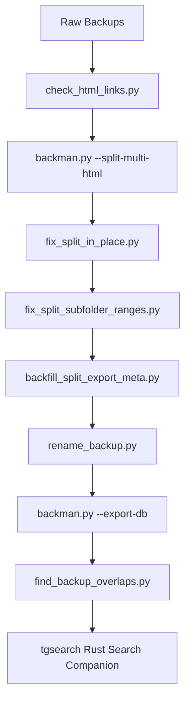

# tgbackman — Telegram Backup Workflows & SQLite Search Indexer

A premium, high-performance command-line toolbox designed to manage, repair, split, rename, analyze, and index massive multi-format Telegram backup archives into a consolidated master SQLite database for optimized full-text searching.

---

## 📂 Project Structure & Directory Tree

```text
/home/lewis/Dev/tgbackman/
├── .gitignore                         # Git exclusion rules
├── README.md                          # Comprehensive project documentation (this file)
├── requirements.txt                   # Python package dependencies
├── backman.py                         # Main discoverer, link checker, and db export controller
├── db_indexer.py                      # Highly optimized SQLite database ingester & parser (HTML/JSON/SQLite)
├── find_backup_overlaps.py            # Overlap, containment, and gap analyzer for sibling backups
├── rename_backup.py                   # Safety-focused UTC chronological folder range renamer
├── check_html_links.py                # Scanner to verify that all local asset links (href/src) resolve
├── fix_split_in_place.py              # Media relocalizer for split exports (avoids asset duplication)
├── fix_split_subfolder_ranges.py      # Standardizes unknown/non-standard range subfolder names
├── backfill_split_export_meta.py      # Meta-file backfiller to register split folders in backman
└── tgsearch/                          # High-performance compiled Rust search companion
    ├── Cargo.toml                     # Rust project manifest
    ├── README.md                      # Rust search utility documentation
    ├── src/                           # Rust search companion source code
    └── rules/                         # Directory for anonymization & sanitization rules
```

---

## 🛠️ Detailed Scripts & Tooling Reference

This section outlines what each script does, its inputs, and its outputs.

### 1. [backman.py](file:///home/lewis/Dev/tgbackman/backman.py)
* **Purpose**: Primary CLI entrypoint and orchestrator. Discovers raw Telegram backups under a root folder, splits multi-chat HTML exports, checks and repairs broken links, and initiates database exports.
* **Inputs**:
  - `root`: A directory path containing raw Telegram backup exports.
* **Outputs**:
  - Summarizes discoverable backups in a human-readable console report.
  - Generates split chat folders (`--split-multi-html`).
  - Repairs or URL-encodes local asset links (`--repair-html-links`).
  - Triggers SQLite database compilation (`--export-db <path>`).
* **Key CLI Invocation Examples**:
  ```bash
  # Standard discovery and summary scan
  python3 backman.py "/media/lewis/1b/Telegram Backup"

  # Split official HTML export into per-chat folders
  python3 backman.py "/media/lewis/1b/Telegram Backup/RawMultiExport" --split-multi-html

  # Recursive database ingestion
  python3 backman.py "/media/lewis/1b/Telegram Backup" --export-db "/media/lewis/1b/sqlitedb/telegram_backup.db"
  ```

### 2. [db_indexer.py](file:///home/lewis/Dev/tgbackman/db_indexer.py)
* **Purpose**: Streamlined, high-performance database indexing engine invoked by `backman.py`. It bypasses common SQLite bottlenecks to process message data at speeds exceeding **200,000 messages per second**.
* **Inputs**:
  - Discovered backup data streams (HTML, JSON, and older SQLite schemas) and a target SQLite database path.
* **Outputs**:
  - A consolidated, FTS5 full-text-indexed SQLite master database with active database triggers to keep virtual index tables perfectly synchronized with new inserts, updates, or deletes.
* **Special Capabilities**:
  - **Memory Streaming HTML Parser**: Direct memory streaming using Python's `HTMLParser` to parse nested tags and resolve reply references, timezone bounds, and attachment fields without high memory consumption.
  - **JSON Streamer**: Memory-efficient stream parsing using the `ijson` library to ingest massive `result.json` files chunk-by-chunk.
  - **SQLite Ingestor**: Maps older unofficial schema structures to the consolidated schema.

### 3. [find_backup_overlaps.py](file:///home/lewis/Dev/tgbackman/find_backup_overlaps.py)
* **Purpose**: Analyzes sibling backups representing the same physical chats, calculates chronological overlap containment percentages, and runs indexed B-tree database range scans to check for missing/misaligned messages in overlap spans.
* **Inputs**:
  - Absolute path to the consolidated master SQLite database (`telegram_backup.db`).
* **Outputs**:
  - Detailed console reports detailing sibling overlap alignments, coverage percentages, and gap warnings for sub-optimal/incomplete exports.
* **CLI Invocation Example**:
  ```bash
  python3 find_backup_overlaps.py "/media/lewis/1b/sqlitedb/telegram_backup.db"
  ```

### 4. [rename_backup.py](file:///home/lewis/Dev/tgbackman/rename_backup.py)
* **Purpose**: Safety-focused UTC chronological folder range renamer. Recursively scans a root folder, identifies multi-format backups, queries their chronological boundaries (minimum/maximum UTC message timestamps), and executes file-system renames to standard `YYYY-MM-DDTHH-MM-SSZ__YYYY-MM-DDTHH-MM-SSZ` ranges.
* **Inputs**:
  - A directory containing raw Telegram backups.
* **Outputs**:
  - Renames folders on disk to timezone-aware UTC chronological ranges.
* **Key CLI Options**:
  - `-d, --dry-run`: Reports planned renames without committing changes to disk.
  - `-v, --verbose`: Outputs detailed parse logs for all processed files.
* **CLI Invocation Example**:
  ```bash
  python3 rename_backup.py "/media/lewis/1b/Telegram Backup" --dry-run
  ```

### 5. [check_html_links.py](file:///home/lewis/Dev/tgbackman/check_html_links.py)
* **Purpose**: Scans all `.html` files in a backup folder and verifies that local on-disk assets (such as images, avatars, or media) resolved by `href`, `src`, `poster`, CSS `url()`, or `srcset` paths actually exist.
* **Inputs**:
  - A directory containing Telegram HTML backups.
* **Outputs**:
  - Console lists of missing/broken local targets.
  - Exit code `0` on success (no missing links), `1` if missing links found, `2` for invalid arguments.
* **CLI Invocation Example**:
  ```bash
  python3 check_html_links.py "/media/lewis/1b/Telegram Backup/ChatName"
  ```

### 6. [fix_split_in_place.py](file:///home/lewis/Dev/tgbackman/fix_split_in_place.py)
* **Purpose**: Fixes split multi-chat HTML exports in-place by relocalizing leftover `../../chats/chat_XXX/...` media references to keep single chat folders standalone without duplicating massive media folders.
* **Inputs**:
  - `single_root`: Split output directory.
  - `--multi-root`: Original multi-chat HTML export root.
* **Outputs**:
  - Copies matched media files and updates HTML links inside the split chat directory.
* **CLI Invocation Example**:
  ```bash
  python3 fix_split_in_place.py "/media/lewis/1b/Telegram Backup/SplitChats" --multi-root "/media/lewis/1b/Telegram Backup/RawMultiExport"
  ```

### 7. [fix_split_subfolder_ranges.py](file:///home/lewis/Dev/tgbackman/fix_split_subfolder_ranges.py)
* **Purpose**: Renames per-chat subfolders in a split multi-chat HTML export where the split step generated a folder with non-standard names like `ChatName/unknown__unknown/` by parsing day separators or timestamps.
* **Inputs**:
  - Split output root directory.
* **Outputs**:
  - Renames directories on disk to standard UTC range-aware names.
* **CLI Invocation Example**:
  ```bash
  python3 fix_split_subfolder_ranges.py "/media/lewis/1b/Telegram Backup/SplitChats" --apply
  ```

### 8. [backfill_split_export_meta.py](file:///home/lewis/Dev/tgbackman/backfill_split_export_meta.py)
* **Purpose**: Backfills `.backman_export_meta.json` files into split output folders to register them within `backman.py` as `html_single_chat_export_converted`.
* **Inputs**:
  - Root split directory.
* **Outputs**:
  - Creates `.backman_export_meta.json` files recursively.
* **CLI Invocation Example**:
  ```bash
  python3 backfill_split_export_meta.py "/media/lewis/1b/Telegram Backup/SplitChats" --apply
  ```

---

## 🔄 End-to-End Master Pipeline Workflow

To ingest your raw Telegram backups, analyze overlaps, and search them cleanly, execute this pipeline in the following sequence:



### 1️⃣ Step 1: Health Check (Optional but Recommended)
Scan your raw HTML files to check if there are missing attachments or assets:
```bash
python3 check_html_links.py "/media/lewis/1b/Telegram Backup/RawExport"
```

### 2️⃣ Step 2: Split Official Multi-Chat HTML Exports
If you have an official multi-chat HTML export containing multiple chats, split it into discrete folders:
```bash
python3 backman.py "/media/lewis/1b/Telegram Backup/RawMultiExport" --split-multi-html
```

### 3️⃣ Step 3: Relocalize Split Assets in Place
Relocalize media file paths in split chats to avoid massive asset duplication while maintaining fully-functioning local files:
```bash
python3 fix_split_in_place.py "/media/lewis/1b/Telegram Backup/SplitChats" --multi-root "/media/lewis/1b/Telegram Backup/RawMultiExport"
```

### 4️⃣ Step 4: Fix Subfolder Naming and Backfill Metadata
Resolve any `unknown__unknown` folder names in split chats, then backfill `.backman_export_meta.json` so they are fully discovered by the main `backman.py` tool:
```bash
python3 fix_split_subfolder_ranges.py "/media/lewis/1b/Telegram Backup/SplitChats" --apply
python3 backfill_split_export_meta.py "/media/lewis/1b/Telegram Backup/SplitChats" --apply
```

### 5️⃣ Step 5: Chronological Folder Standardization
Standardize folder names based on actual minimum/maximum UTC timestamps:
```bash
# Check planned folder names
python3 rename_backup.py "/media/lewis/1b/Telegram Backup/Standardized" --dry-run

# Execute folder renames on disk
python3 rename_backup.py "/media/lewis/1b/Telegram Backup/Standardized"
```

### 6️⃣ Step 6: Master Database Ingestion
Index all standardized backups recursively into a single, high-performance search-optimized master SQLite database file:
```bash
python3 backman.py "/media/lewis/1b/Telegram Backup/Standardized" --export-db "/media/lewis/1b/sqlitedb/telegram_backup.db"
```

### 7️⃣ Step 7: Overlap and Gap Analysis
Analyze the integrity of your backup database, verifying alignment coverages and identifying any missing messages:
```bash
python3 find_backup_overlaps.py "/media/lewis/1b/sqlitedb/telegram_backup.db"
```

### 8️⃣ Step 8: Search Companion Ingestion
Navigate to the `tgsearch/` subdirectory and invoke the ultra-fast Rust search companion `tgsearch` to perform query searches, deduplication, and case-insensitive username sanitization:
```bash
# Navigate and build (if not already built)
cd tgsearch
cargo build --release

# Execute query searches
./target/release/tgsearch "/media/lewis/1b/sqlitedb/telegram_backup.db" "makeup OR alcohol" --no-time -l 80 --dedupe --no-header --sanitise "rules/bad_language_rules.txt"
```

---

## 🔒 Security, Privacy & Performance Designs

> [!IMPORTANT]
> **Performance Optimization**: `db_indexer.py` leverages bulk transaction batches (50,000+ operations per transaction) coupled with SQLite write-ahead-logging (`PRAGMA journal_mode=WAL`), asynchronous synchronization (`PRAGMA synchronous=NORMAL`), and large cache allocations to achieve lightning-fast throughput exceeding **200,000 messages/sec**.

> [!NOTE]
> **Leak-Proof Sanitization**: When querying the master database through `tgsearch` with `--sanitise`, the engine employs automatic name-aliasing. A user's target variations (e.g. `lewis` and `siwel`) are linked together so that substituting one automatically substitutes both in a case-insensitive fashion. This preserves total sender privacy.

> [!WARNING]
> **Database Locks**: While ingestion utilizes WAL mode, always ensure that other handles to the SQLite database (like active search queries) are read-only or closed during heavy write pipelines to prevent database busy lock scenarios (`SQLITE_BUSY`).
